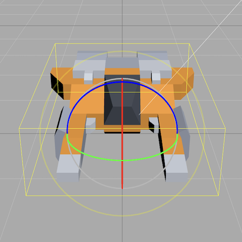
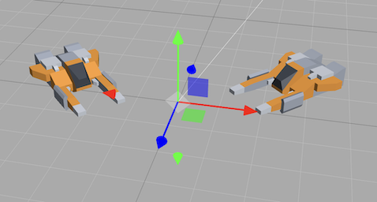

# three_js_editor_small

Demo: https://leweyg.github.io/three_js_editor_small/

Code: https://github.com/leweyg/three_js_editor_small 

## Setup

``git clone https://github.com/leweyg/three_js_editor_small.git``

``./three_js_editor_small/run_editor.sh`` (opens http://localhost:5678/three_js_editor_small/)

With content (edits are save-able back to the git):

``git clone https://github.com/leweyg/heroine_dawn.git``

``open http://localhost:5678/three_js_editor_small/editor/?file_path=../../heroine_dawn/web/models/map_1.json``

## Description

A small (~20MB) local and web hostable Three.js editor,
with URL-parameter based file loading, local shell integration (allows folder browsing and git functions).
Useful for projects needing a small 3D editor.

The original Three.js Editor (which is near 1GB of git)
was branched to add URL and shell integration into the
Lewcid Editor, which was used to create Heroine Dawn and other personal projects,
and is here reduced signifcantly into this git. 

- Three.js: https://threejs.org/ 
- Lewcid Editor: https://leweyg.github.io/lewcid_editor/
- Heroine Dawn : https://leweyg.github.io/heroine_dawn/ 
